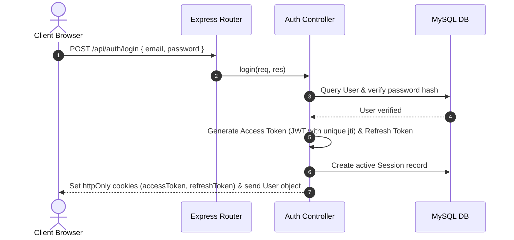
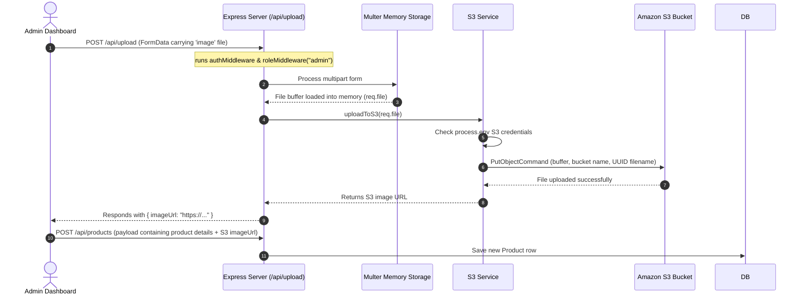

# E-Commerce App Project Architecture & Flow Documentation

This document provides a detailed overview of the application flow, codebase structure, database schema, authentication mechanisms, and AWS S3 file upload integration.

---

## 📂 Project Directory Structure

The project is split into a client-server architecture:

```
StateManagement/
├── frontend/                 # React Frontend (Vite)
│   ├── src/
│   │   ├── components/       # Reusable UI components (Navbar, ProductCard, Footer)
│   │   ├── context/          # State management (AuthContext, CartContext, WishlistContext)
│   │   ├── pages/            # Page components (Home, ProductDetails, Wishlist, Cart, Admin)
│   │   ├── App.jsx           # Routing & overall entry layout
│   │   └── api.js            # Axios client instance with token refresh interceptor
│
└── backend/                  # Node.js Express Backend
    ├── src/
    │   ├── config/           # Database configuration (Sequelize / MySQL)
    │   ├── controllers/      # Route handler controllers (auth, product, wishlist, cart, upload)
    │   ├── middleware/       # Express middlewares (auth, role, error handlers)
    │   ├── models/           # Sequelize Model definitions (User, Product, Cart, Order, etc.)
    │   ├── routes/           # REST API routes declarations
    │   ├── services/         # Business logic & Database services (wishlist, cart, S3 services)
    │   └── app.js            # Express app configuration (CORS, cookies parser, route mounting)
    ├── server.js             # Server entry point
    └── .env                  # Environment configurations
```

---

## 🗄️ Database Model Relationships (MySQL via Sequelize)

The database models are interconnected as shown below:

```mermaid
erDiagram
    User ||--o[Session] : "has many"
    User ||--o| Cart : "has one"
    User ||--o| Wishlist : "has one"
    User ||--o[Order] : "has many"
    User ||--o[Review] : "has many"
    
    Category ||--o[Product] : "has many"
    Category ||--o[Banner] : "has many"
    
    Cart ||--o[CartItem] : "has many"
    Product ||--o[CartItem] : "has many"
    
    Wishlist ||--o[WishlistItem] : "has many"
    Product ||--o[WishlistItem] : "has many"
    
    Order ||--o[OrderItem] : "has many"
    Product ||--o[OrderItem] : "has many"
    
    Product ||--o[Review] : "has many"
```

---

## 🔐 1. Authentication & Session Flow

The application handles standard Email/Password authentication as well as Google OAuth 2.0.

### A. Access & Refresh Tokens (JWT)
* **Access Token:** Short-lived JWT (15 minutes) stored in an `httpOnly` cookie containing the `userId`, `role`, and a unique `jti` (JWT ID). Used to authenticate incoming requests.
* **Refresh Token:** Long-lived JWT (7 days) stored in an `httpOnly` cookie used to obtain a new access token when the current one expires.
* **Session Verification:** A `Session` model tracks active refresh tokens and JTIs in the database.

### B. Standard Login & Middleware Architecture


### C. The JWT Authentication Middleware (`authMiddleware`)
Every protected route runs through [auth.middleware.js](file:///Users/arjavjain/StateManagement/backend/src/middleware/auth.middleware.js):
1. **Extraction:** Retrieves the `accessToken` from request cookies.
2. **Signature Verification:** Verifies the token signature using the `ACCESS_SECRET`.
3. **Database Check:** Queries the `Session` table using the token's `jti`. If the session is missing, it returns `401 Unauthorized` (indicating the user logged out).
4. **Context Injection:** Finds the `User` record in the database, sets it to `req.user`, and calls `next()`.

### D. Google OAuth 2.0 Flow
1. User clicks **"Login with Google"** in the frontend.
2. Frontend redirects to `/api/auth/google`, which redirects to Google's consent screen.
3. Once authorized, Google redirects back to `/api/auth/google/callback` with an **Authorization Code**.
4. The backend exchanges this code for Google access tokens via Google API, fetches user details (email, name, Google ID), finds or creates a matching user in the database, generates cookies, and redirects the client back to the React home page (`http://localhost:5173`).

---

## ☁️ 2. AWS S3 Image Upload Flow

Images are uploaded directly to Amazon S3 via the admin dashboard without intermediate storage on the local server disk.

### Execution Path


> [!IMPORTANT]
> **No Local Fallback:** Multer is configured to use `memoryStorage()`, which keeps the files in system RAM. The `uploadLocal()` service is completely disabled. If S3 configuration keys (`AWS_REGION`, `AWS_ACCESS_KEY`, `AWS_SECRET_ACCESS_KEY`, `AWS_S3_BUCKET`) are missing, the server returns a `500 Server Error` instead of storing files locally.

---

## 🛒 3. State Management & Context Syncing

The application uses React's Context API to manage user state, synchronize listings, and persist carts/wishlists to the database.

### A. Wishlist Flow
* **Context:** [WishlistContext.jsx](file:///Users/arjavjain/StateManagement/frontend/src/context/WishlistContext.jsx) manages a global `wishlist` array.
* **Initialization:** Once `isAuthenticated` becomes true, the provider calls `GET /api/wishlist` to load saved wishlist items.
* **Adding/Removing:**
  * Adding a product calls `POST /api/wishlist` with the `{ productId }`, creating a `WishlistItem` row.
  * Removing calls `DELETE /api/wishlist/:productId`, deleting the corresponding `WishlistItem`.
  * The frontend then fetches the updated list to sync UI states.

### B. Cart Flow
* **Context:** `CartContext.jsx` manages `cartItems` and quantities.
* **Syncing:** Similar to the wishlist, updating quantities, adding to cart, or deleting items calls `/api/cart` routes in the backend to synchronize the MySQL database so that user carts persist across sessions and logins.
