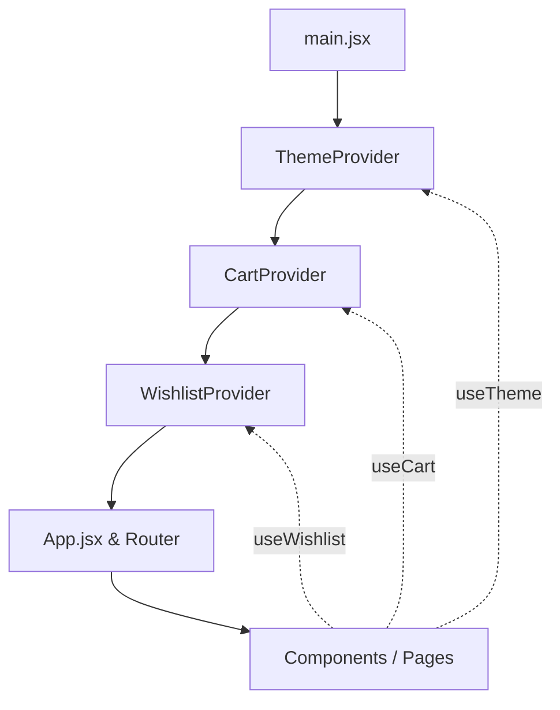

# React Context API Usage Guide

This document explains how state management is handled in this application using React's native **Context API**.

## Table of Contents
1. [Overview](#1-overview)
2. [Context Architecture](#2-context-architecture)
3. [Context Definitions](#3-context-definitions)
    - [Theme Context](#theme-context)
    - [Cart Context](#cart-context)
    - [Wishlist Context](#wishlist-context)
4. [How Contexts are Registered](#4-how-contexts-are-registered)
5. [How to Consume Contexts (Usage Examples)](#5-how-to-consume-contexts-usage-examples)
6. [Best Practices and Extension Guide](#6-best-practices-and-extension-guide)

---

## 1. Overview

The **Context API** is a built-in React feature that allows passing data down the component tree without having to pass props manually at every level (avoiding "prop drilling").

In this project, Context is used to manage global state across the entire e-commerce frontend:
* **Theme state** (Light vs. Dark mode)
* **Shopping Cart state** (Adding, removing, increasing/decreasing quantities, clearing)
* **Wishlist state** (Toggling items, adding, removing)

---

## 2. Context Architecture

Each context in the application follows a standardized design pattern:
1. **Context Creation**: Created using React's `createContext()`.
2. **Provider Component**: A wrapper component (`<XProvider>`) that holds the state logic (using `useState`) and exposes the state and functions through the `<XContext.Provider value={...}>`.
3. **Custom Hook**: A custom hook (`useX()`) that wraps `useContext(XContext)` for easier imports and clean consumption.



---

## 3. Context Definitions

All context files are located in [frontend/src/context](file:///Users/arjavjain/StateManagement/frontend/src/context):

### Theme Context
File: [ThemeContext.jsx](file:///Users/arjavjain/StateManagement/frontend/src/context/ThemeContext.jsx)
Manages the visual theme of the application.
* **State**: `theme` (string: `"light"` or `"dark"`)
* **Actions**: `toggleTheme()` (switches between `"light"` and `"dark"`)

### Cart Context
File: [CartContext.jsx](file:///Users/arjavjain/StateManagement/frontend/src/context/CartContext.jsx)
Manages shopping cart operations and persistent state logic.
* **State**: `cartItems` (array of objects with `quantity`)
* **Derived State**: `totalItems` (number)
* **Actions**:
  * `addToCart(product)` - Adds an item to the cart or increments its quantity if it already exists.
  * `remove(id)` - Removes an item from the cart.
  * `increaseQuantity(id)` - Increments quantity by 1.
  * `decreaseQuantity(id)` - Decrements quantity by 1, automatically removing the item if its quantity reaches 0.
  * `clearCart()` - Resets `cartItems` to an empty array.

### Wishlist Context
File: [WishlistContext.jsx](file:///Users/arjavjain/StateManagement/frontend/src/context/WishlistContext.jsx)
Manages favorited items.
* **State**: `wishlist` (array of products)
* **Actions**:
  * `addToWishlist(product)` - Adds an item if not already present.
  * `removeFromWishlist(id)` - Removes an item by ID.
  * `toggleWishlist(product)` - Toggles inclusion of the item in the wishlist.

---

## 4. How Contexts are Registered

To make the global state available throughout the entire app, the Providers wrap the `<App />` root component in [main.jsx](file:///Users/arjavjain/StateManagement/frontend/src/main.jsx):

```jsx
import { ThemeProvider } from "./context/ThemeContext";
import { CartProvider } from "./context/CartContext";
import { WishlistProvider } from "./context/WishlistContext";

ReactDOM.createRoot(document.getElementById("root")).render(
  <React.StrictMode>
    <ThemeProvider>
      <CartProvider>
        <WishlistProvider>
          <App />
        </WishlistProvider>
      </CartProvider>
    </ThemeProvider>
  </React.StrictMode>
);
```

---

## 5. How to Consume Contexts (Usage Examples)

Using the custom hooks makes consuming global state clean and avoids importing `useContext` and the Context instance separately.

### Example 1: Consuming Theme in `Navbar.jsx`
Here, we read the current theme to render the emoji, and invoke `toggleTheme` on button click:

```jsx
import { useTheme } from "../context/ThemeContext";

function Navbar() {
  const { theme, toggleTheme } = useTheme();

  return (
    <button className="theme-toggle-btn" onClick={toggleTheme}>
      {theme === "light" ? "🌙 Dark" : "☀️ Light"}
    </button>
  );
}
```

### Example 2: Interacting with Cart and Wishlist in `ProductCard.jsx`
We can read the cart items and wishlist state and perform actions directly:

```jsx
import { useWishlist } from "../context/WishlistContext";
import { useCart } from "../context/CartContext";

function ProductCard({ product }) {
  const { wishlist, toggleWishlist } = useWishlist();
  const { cartItems, addToCart } = useCart();

  const isInWishlist = wishlist.some((item) => item.id === product.id);
  const cartItem = cartItems.find((item) => item.id === product.id);
  const quantity = cartItem ? cartItem.quantity : 0;

  return (
    <div className="product-card">
      <button onClick={() => toggleWishlist(product)}>
        {isInWishlist ? "❤️ Wishlist" : "🤍 Wishlist"}
      </button>
      
      <button onClick={() => addToCart(product)}>
        {quantity > 0 ? `Added (${quantity})` : "Add to Cart"}
      </button>
    </div>
  );
}
```

---

## 6. Best Practices and Extension Guide

### 💡 Adding a New Context
To add a new context (e.g., `AuthContext` for user login states):
1. Create `src/context/AuthContext.jsx`.
2. Implement `createContext()`, `<AuthProvider>`, and `useAuth` hook.
3. Wrap `<AuthProvider>` inside `<ThemeProvider>` in [main.jsx](file:///Users/arjavjain/StateManagement/frontend/src/main.jsx).

### ⚡ Performance Considerations
* When a Context Provider's value changes, all components consuming that context will re-render.
* Keep context granular (e.g., separating `ThemeContext` from `CartContext` prevents a theme toggle from causing cart list re-renders).
* For large apps or highly frequent state changes, consider localizing state or migrating to Redux Toolkit (RTK) / Zustand.
