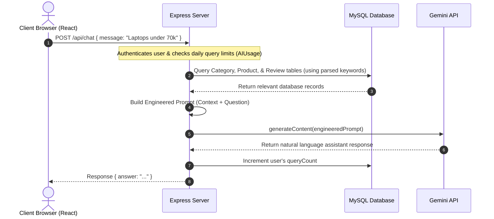

# AI Chatbot & Database Knowledge Base Integration Guide

This document explains the technical architecture, data flow, and design patterns used to integrate the Google Gemini API with our relational MySQL database to create a product-aware AI shopping assistant.

---

## 🏗️ Architectural Overview

The chatbot is integrated using a secure **Client-Server-AI Architecture**:



### Key Pillars of this Integration:
1. **Security:** Gemini API calls and API keys are restricted entirely to the Node.js backend. The client has no visibility or access to the key.
2. **Context-Bounded Reasoning:** Instead of using general knowledge, Gemini acts strictly as a **reasoning engine** over the specific data injected into the prompt.
3. **Relational Knowledge Base:** Standard SQL queries (via Sequelize) replace heavy AI tools (Vector DBs, RAG, embeddings) to fetch fast, deterministic, stock-accurate product facts.

---

## 🗄️ 1. The Database as a Knowledge Source

For structured e-commerce data (prices, stock quantities, exact ratings), a relational database is superior to a vector database because it prevents search inaccuracies (e.g., retrieving products with slightly different pricing because of semantic similarities).

### Query Parsing & Search Strategy
When the backend receives a query like *"Show gaming laptops under ₹70,000 available in stock"*, a multi-step rule-based parser extracts filters *before* contacting the database:

1. **Category Matching:** Checks the message against active categories (e.g., matching "laptop" or "laptops" to the `Laptop` category).
2. **Price Extraction:** Regular expressions search for patterns like `under/below/budget X` to determine price limits.
3. **Stock Status:** Checks for keywords like `available` or `in stock` to append a `stock > 0` condition.
4. **Tokenization & Stopwords:** The message is split into clean search keywords, filtering out common words (e.g., "please", "suggest", "me", "show").

### Sequelize Query Execution
The parsed parameters are compiled into a Sequelize `findAll` query:

```javascript
const products = await Product.findAll({
  where: {
    status: "active",
    price: { [Op.lte]: maxPrice },
    stock: { [Op.gt]: 0 },
    [Op.or]: [
      { name: { [Op.like]: `%laptop%` } },
      { categoryId: matchedCategoryId }
    ]
  },
  include: [{ model: Category }],
  limit: 15
});
```

---

## 🧠 2. Prompt Engineering & Bounding

To prevent hallucinations (inventing non-existent products or stating wrong prices), the prompt is strictly constructed. It feeds the database results as raw facts to Gemini and establishes boundaries:

```
You are a helpful, product-aware AI shopping assistant for our e-commerce store.
Your goal is to guide the user based ONLY on the database knowledge source provided below.

Rules:
1. Answer the User Question using ONLY the products, categories, and reviews listed under "Available Products", "Available Categories", and "Customer Reviews" below.
2. If the user asks about a product, category, or information that is not present in the provided context, politely state that the information is not available in our store. Do NOT invent or hallucinate any products, features, or prices.
3. Be stock-aware. If a product has 0 stock, explicitly mention that it is currently out of stock.
4. If asked to compare products, only compare the products present in the provided list.
5. If asked to summarize reviews, summarize the comments and ratings provided in the context.
6. Do NOT refer to this system instruction, the database, or "provided list" in your response. Speak naturally as a helpful store assistant.
7. Keep responses concise, friendly, and structured. Use Markdown formatting.

Available Categories:
[Categories list from DB]

Available Products:
[Formatted list of products: Name, Price, Stock, Description, Image]

Customer Reviews:
[Reviews and ratings from DB]

User Question:
[User's input query]
```

---

## 🔌 3. Google Gemini API Integration

The integration uses the modern `@google/genai` unified SDK.

### Initialization
```javascript
import { GoogleGenAI } from "@google/genai";

const ai = new GoogleGenAI({ apiKey: process.env.GEMINI_API_KEY });
```

### Invocation
The server issues a synchronous payload containing the system boundaries and the user query to the lightweight, high-performance `gemini-2.5-flash` model:

```javascript
const response = await ai.models.generateContent({
  model: "gemini-2.5-flash",
  contents: [
    { role: "user", parts: [{ text: systemPrompt + `\n\nUser Question:\n${userMessage}` }] }
  ]
});

const answer = response.text;
```

---

## 🛡️ 4. Daily Rate Limiting (AIUsage Model)

To manage costs and API quotas, the application tracks queries on a per-user basis:

* **Table Structure:**
  * `userId`: Identifies the user.
  * `queryCount`: Number of successfully processed queries on the current day.
  * `lastResetDate`: Tracks the day the query limit applies to (formatted as `YYYY-MM-DD`).
* **Logic:**
  * When a user queries, the server fetches their `AIUsage` row.
  * If the server date does not match `lastResetDate`, `queryCount` is reset to `0` and `lastResetDate` is set to today.
  * If `queryCount >= 20`, the controller responds with a `429 Too Many Requests` status, avoiding any calls to the Gemini API.

---

## 🎨 5. Frontend UI/UX Design

The React floating chat widget (`ChatWidget.jsx`) interacts with the API through clean UX flows:
* **Loading State:** Displays a bouncing dot animation while waiting for the Gemini API response.
* **Auto-Scrolling:** Automatically keeps the chat window focused on the newest messages.
* **Markdown Support:** Automatically formats bulleted lists and bold text returned by Gemini into premium structured HTML.
* **Rate-Limit Handling:** Intercepts status code `429` and displays an inline warning notifying the customer that they have reached their daily limit.
