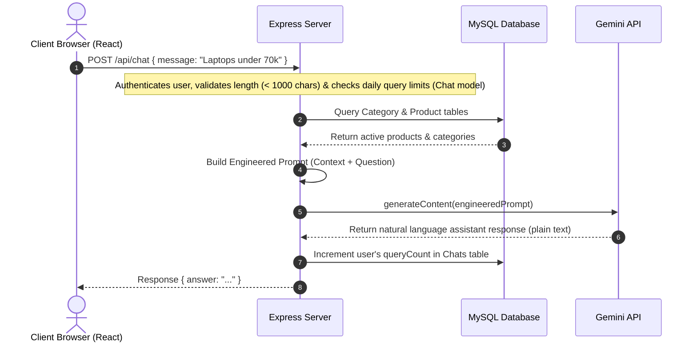

# AI Chatbot & Database Knowledge Base Integration Guide

This document explains the technical architecture, data flow, and design patterns used to integrate the Google Gemini API with our relational MySQL database to create a product-aware AI shopping assistant.

---

## 🏗️ Architectural Overview

The chatbot is integrated using a secure **Client-Server-AI Architecture**:



### Key Pillars of this Integration:
1. **Security:** Gemini API calls and API keys are restricted entirely to the Node.js backend. The client has no visibility or access to the key.
2. **Context-Bounded Reasoning:** Instead of using general knowledge, Gemini acts strictly as a **reasoning engine** over the specific data injected into the prompt.
3. **Relational Knowledge Base:** Standard SQL queries (via Sequelize) replace heavy AI tools (Vector DBs, RAG, embeddings) to fetch fast, deterministic, stock-accurate product facts.

---

## 🗄️ 1. The Database as a Knowledge Source

For structured e-commerce data (prices, stock quantities, exact availability), a relational database acts as our source of truth. Rather than using complex RAG/vector search, we fetch active catalogs directly from the MySQL database using Sequelize to ensure accuracy and real-time consistency.

### Knowledge Retrieval Strategy
When a chat request is processed, the backend retrieves all active catalog data:
1. **Category Retrieval:** Fetches all available categories in the store.
2. **Active Product Retrieval:** Fetches all active products along with their associated category, price, stock, and descriptions.

### Sequelize Query Execution
The query fetches the complete list of products and categories to pass to Gemini as the context:

```javascript
const allCategories = await Category.findAll();
const products = await Product.findAll({
  where: { status: "active" },
  include: [{ model: Category, attributes: ["id", "name"] }]
});
```

This data is then formatted into a textual list mapping names, prices, stock levels, and categories before being injected into the system prompt context.

---

## 🧠 2. Prompt Engineering & Bounding

To prevent hallucinations (inventing non-existent products or stating wrong prices), the prompt is strictly constructed. It feeds the database results as raw facts to Gemini and establishes boundaries:

```
You are an AI shopping assistant for our e-commerce store.

The store catalog below is the source of truth for:
* Product existence
* Product availability
* Product prices
* Product stock values
* Product descriptions provided by the store

Rules:
1. Only recommend products that exist in the provided catalog.
2. Never invent products that are not present in the catalog.
3. Never invent prices, stock values, discounts, ratings, reviews, or availability.
4. If a product is not present in the catalog, explain that it is not currently available in our store.
5. Use the catalog information as authoritative whenever it conflicts with general knowledge.
6. You may use generally known information about a product model to provide additional context, comparisons, or recommendations when you are reasonably confident that the product refers to the same model.
7. Do not invent technical specifications that are uncertain or unavailable.
8. If you are not confident about a specification, state that the information is unavailable.
9. For budget questions, use catalog prices only.
10. For availability questions, use catalog stock values only.
11. When comparing products, prioritize catalog information first, then supplement with generally known product characteristics when helpful.
12. If the catalog description is sparse, use the product name and generally known characteristics to help explain strengths and use cases.
13. If the user asks for the best product for gaming, photography, productivity, battery life, or similar use cases, you may use generally known characteristics of the products present in the catalog to make recommendations.
14. Never claim information came from the internet, web search, training data, or external sources.
15. Keep responses concise, conversational, and customer-focused.
16. Return plain text only.
17. Do not use Markdown, HTML, emojis, bullet points, or numbered lists.
18. Respond naturally as a shopping assistant for the store.

Available Categories:
[Categories list from DB]

Available Products:
[Formatted list of products: Name, Price, Stock, Description, Category]

User Question:
[User's input query]
```

---

## 🔌 3. Google Gemini API Integration

The integration uses the modern `@google/genai` unified SDK.

### Initialization
```javascript
import { GoogleGenAI } from "@google/genai";

const ai = new GoogleGenAI({ apiKey: process.env.GEMINI_API_KEY });
```

### Invocation
The server issues a synchronous payload containing the system boundaries and the user query to the lightweight, high-performance `gemini-2.5-flash` model:

```javascript
const response = await ai.models.generateContent({
  model: "gemini-2.5-flash",
  contents: [
    { role: "user", parts: [{ text: systemPrompt + `\n\nUser Question:\n${userMessage}` }] }
  ]
});

const answer = response.text;
```

---

## 🛡️ 4. Daily Rate Limiting & Input Validation (Chat Model)

To manage costs, API quotas, and prevent server overload, the application enforces constraints on chat messages:

* **Input Validation:**
  * Enforces that the request body contains a non-empty `message` string.
  * Limits the message length to a maximum of 1000 characters to prevent prompt injection or extremely large payloads.
* **Table Structure (Chat Model):**
  * `userId`: Identifies the authenticated user.
  * `queryCount`: Number of successfully processed queries on the current day.
  * `lastResetDate`: Tracks the day the query limit applies to (formatted as `YYYY-MM-DD`).
* **Rate Limiting Logic:**
  * When a user queries, the server fetches their `Chat` usage record (using `findOrCreate`).
  * If the server date does not match `lastResetDate`, the `queryCount` is reset to `0` and `lastResetDate` is set to today.
  * If `queryCount >= 20`, the controller responds with a `429 Too Many Requests` status, avoiding any calls to the Gemini API.
  * For successful requests, the user's `queryCount` is incremented atomically using `usageRecord.increment("queryCount", { by: 1 })`.

---

## 🎨 5. Frontend UI/UX Design

The React floating chat widget (`ChatBot.jsx`) interacts with the API through clean UX flows:
* **Loading State:** Displays a bouncing dot animation while waiting for the Gemini API response.
* **Auto-Scrolling:** Automatically keeps the chat window focused on the newest messages.
* **Conversational Plain Text:** Renders clean, natural, plain text responses as instructed in the system prompt rules to ensure a smooth, uniform chatbot conversational layout.
* **Rate-Limit Handling:** Intercepts status code `429` and displays an inline warning notifying the customer that they have reached their daily limit.
