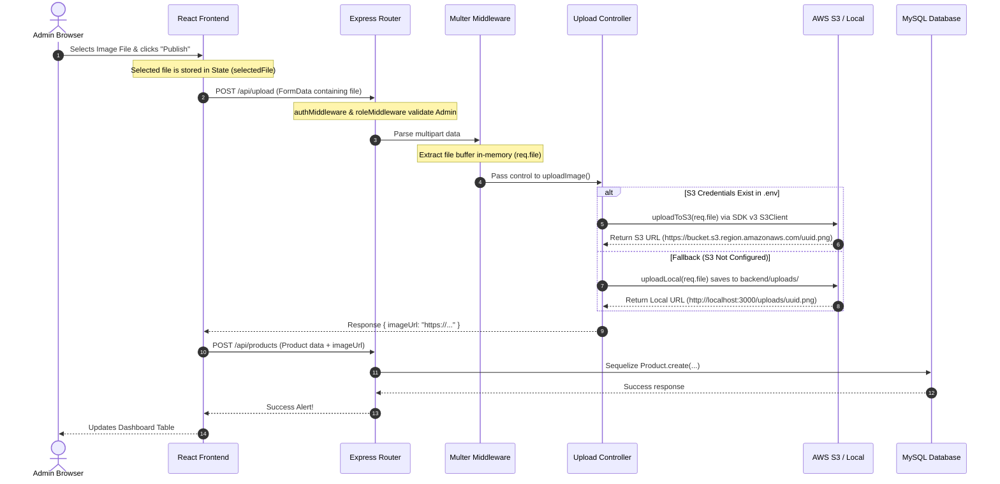

# End-to-End Image Upload Data Flow

This document details the exact sequence of events, components, and data transfers that occur when an administrator uploads a product image.

---



---

## Detailed Step-by-Step Flow

### Step 1: User Chooses a File in React (Frontend)
1. The administrator opens the **Add Product** modal.
2. Clicking the dashed drop-zone triggers a file picker. Selecting a file triggers the `handleFileChange` method:
   - Sets the `selectedFile` React state to the raw JavaScript `File` object.
   - Uses `FileReader` to read the file in-memory and sets `imagePreview` state to a Base64 string so the admin sees an instant thumbnail preview.

### Step 2: User Submits the Product
1. The admin clicks the **Publish** or **Save as Draft** button.
2. The `handleProductSubmit` function intercepts the form submission:
   - If `selectedFile` is present, it temporarily halts product creation to perform the file upload.
   - It instantiates a standard browser `FormData` object and appends the file under the key name `"image"`:
     ```javascript
     const formData = new FormData();
     formData.append("image", selectedFile);
     ```
   - It fires an HTTP request: `POST http://localhost:3000/api/upload` containing the `FormData` body and the `Content-Type: multipart/form-data` header.

### Step 3: Backend Middleware Interceptors
1. **Routing**: The backend Router matches the request on `POST /api/upload` ([upload.routes.js](file:///Users/arjavjain/StateManagement%20copy/backend/src/routes/upload.routes.js)).
2. **Security**:
   - `authMiddleware` reads the `accessToken` cookie and decodes it to verify the user is logged in.
   - `roleMiddleware(["admin"])` validates that the user holds the `admin` role. If unauthorized, it rejects the request with a `403 Forbidden` status.
3. **Multipart Parser**:
   - `multer({ storage: multer.memoryStorage() }).single("image")` parses the raw multipart boundary stream.
   - It reads the file chunk streams into a byte buffer in the server's RAM and attaches a structured file object to the Express request object as `req.file`.

### Step 4: Controller Decision Layer
The request enters the `uploadImage` controller ([upload.controller.js](file:///Users/arjavjain/StateManagement%20copy/backend/src/controllers/upload.controller.js)):
1. It checks if the required S3 environment variables are loaded in `process.env`.
2. **Path A (S3 Upload)**:
   - Instantiates an `S3Client` loaded with your region, access key ID, and secret access key.
   - Extracts the file extension (e.g., `.png`) and generates a random unique key using `uuidv4()` to avoid filename conflicts.
   - Dispatches a `PutObjectCommand` to stream the buffer to S3 with correct public ACL settings:
     ```javascript
     const command = new PutObjectCommand({
       Bucket: process.env.AWS_S3_BUCKET,
       Key: key,
       Body: file.buffer,
       ContentType: file.mimetype,
     });
     ```
   - Returns the AWS resource link: `https://<bucket>.s3.<region>.amazonaws.com/<key>`.
3. **Path B (Local Fallback)**:
   - Resolves the absolute path to a local directory `/backend/uploads`.
   - Generates a UUID filename and writes the file buffer asynchronously using `fs.promises.writeFile`.
   - Returns a local static URL pointing to the node server: `http://localhost:3000/uploads/<filename>`.

### Step 5: Product Record Created in Database
1. The frontend receives the response from the upload request containing `{ imageUrl: "..." }`.
2. React finishes `handleProductSubmit` by compiling the product payload (`name`, `price`, `stock`, `categoryId`, etc.) alongside the returned `imageUrl`.
3. React fires the final creation request: `POST http://localhost:3000/api/products` (carrying the URL).
4. The product controller calls `Product.create(...)` which inserts a new row in your MySQL database containing the hosted image URL.
5. The frontend displays a success alert, clears state triggers, and refreshes dashboard tables.
